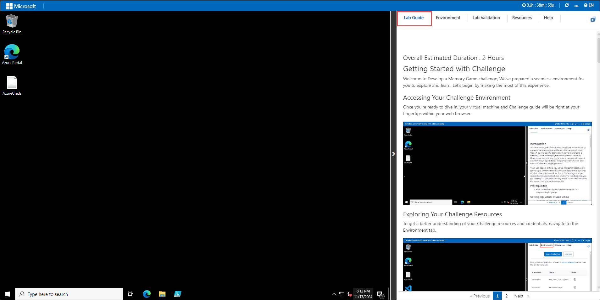
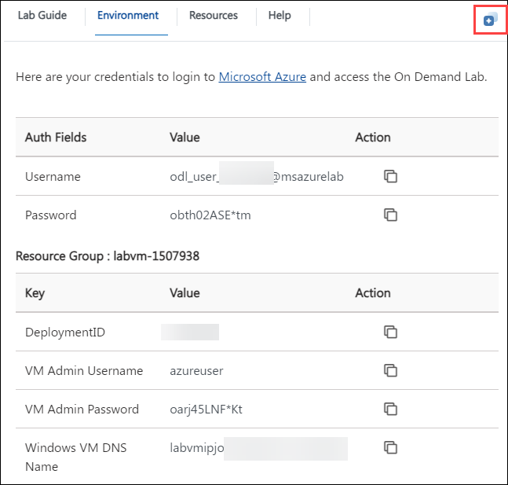

# Getting started with Challenge Environment

### Overall Estimated Duration : 2 Hours

Welcome to Copilot Hackathon, We've prepared a seamless environment for you to explore and learn. Let's begin by making the most of this experience.

### Accessing Your Challenge Environment

Once you're ready to dive in, your virtual machine and Challenge guide will be right at your fingertips within your web browser.

### Exploring Your Challenge Resources

To get a better understanding of your Challenge resources and credentials, navigate to the Environment tab.

### Utilizing the Split Window Feature

For convenience, you can open the Challenge guide in a separate window by selecting the Split Window button from the Top right corner

### Managing Your Virtual Machine

Feel free to start, stop, or restart your virtual machine as needed from the Resources tab. Your experience is in your hands!

## Let's Get Started with Azure Portal

1. In the JumpVM, click on **Azure portal** shortcut of Microsoft Edge browser which is created on desktop.

   

2. On **Sign into Microsoft Azure** tab you will see login screen, in that enter following email/username and then click on **Next**.

   - Email/Username: <inject key="AzureAdUserEmail"></inject>
     
     

3. Now enter the following password and click on **Sign in**.

   - Password: <inject key="AzureAdUserPassword"></inject>

     

     >**Note:** If you see the Action Required dialog box, then select Ask Later option.

     

4. If you see the pop-up **Stay Signed in?**, click No.

5. If you see the pop-up **You have free Azure Advisor recommendations!**, close the window to continue the Challenge.

6. If a **Welcome to Microsoft Azure** popup window appears, click **Cancel** to skip the tour.

9. Now, click on the **Next** from lower right corner to move on next page.

## Happy Learning!!